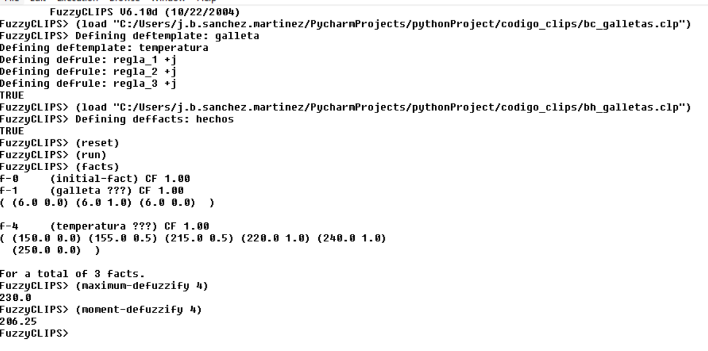

# Ejercicio de las galletas de la abuela María

# Control difuso de un horno con un sistema experto implementado en CLIPS

## Descripción

La abuela María prepara sus deliciosas galletas caseras de forma artesanal desde hace más
de 40 años. El toque secreto de la receta consiste en hornearlas cuidadosamente hasta que
toman su característico color dorado. Durante este delicado proceso la abuela María
observa periódicamente las galletas y ajusta la temperatura del horno de forma adecuada:
- a) Si las galletas están un poco crudas, entonces la temperatura del horno debe ser media.
- b) Si las galletas están medio hechas, entonces la temperatura del horno debe ser alta.
- c) Si las galletas están doraditas, entonces la temperatura del horno debe ser baja.

Tras diversas entrevistas con la abuela se han podido establecer los siguientes conjuntos
difusos sobre un índice cromático especial (0 = galleta cruda; 10 = galleta chamuscada) y la
temperatura del horno.

Índice cromático correspondiente a las galletas:
-  un poco crudas: (1/4, 0.5/6, 0/7)
-  medio hechas: (0/3, 1/5, 1/6, 0/8)
-  doraditas: (0/5, 1/7)

Temperatura del horno (°C):
- baja: (0/150, 1/160, 1/180, 0/190)
- media: (0/170, 1/190, 1/210, 0/230)
- alta: (0/210, 1/220, 1/240, 0/250)

Se construye un sistema para el control automático de la temperatura del horno basado en
reglas. Suponiendo que en cierto momento el índice cromático de las galletas es 6, se pide
implementar en CLIPS la base de conocimientos y la base de hechos y calcular el valor de
temperatura aplicado al horno.

## Resultado

Hemos creado los archivos `bc_galletas.clp` y `bh_galletas.clp` que contienen la base de conocimientos y la base de hechos respectivamente. 
A continuación se muestra el resultado de la ejecución del programa en la que hemos seguido los siguientes pasos:
- Cargar la base de conocimientos (`bc_galletas.clp`).
- Cargar la base de hechos (`bh_galletas.clp`).
- Hacemos un reset.
- Ejecutamos el programa.
- Mostramos los facts.
- Mostramos el sistema difuso.

### @Autor: José Sánchez Martínez"
### @Autor: Alejandro Fernández Barrionuevo"
